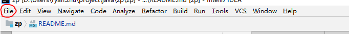
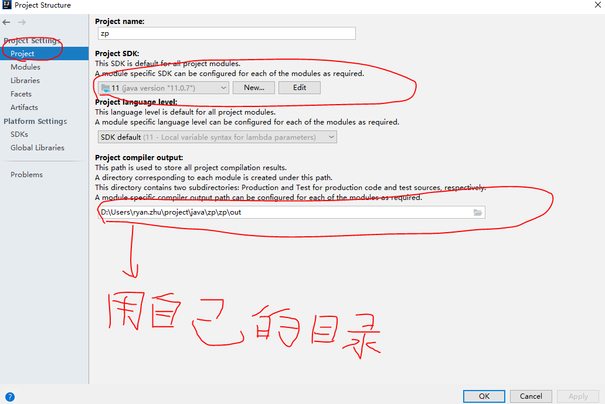
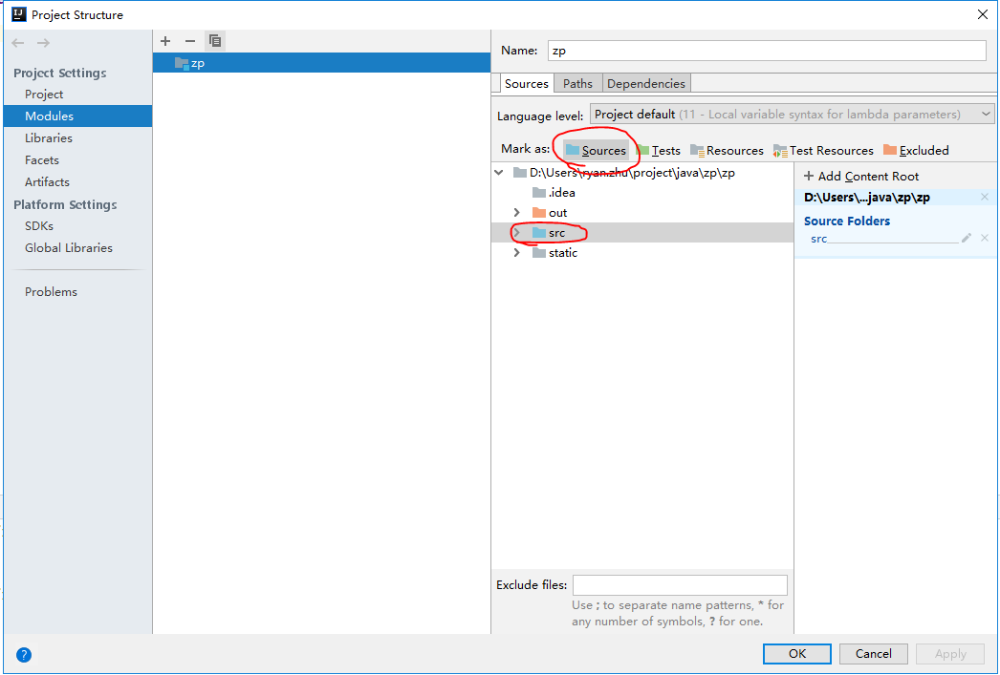
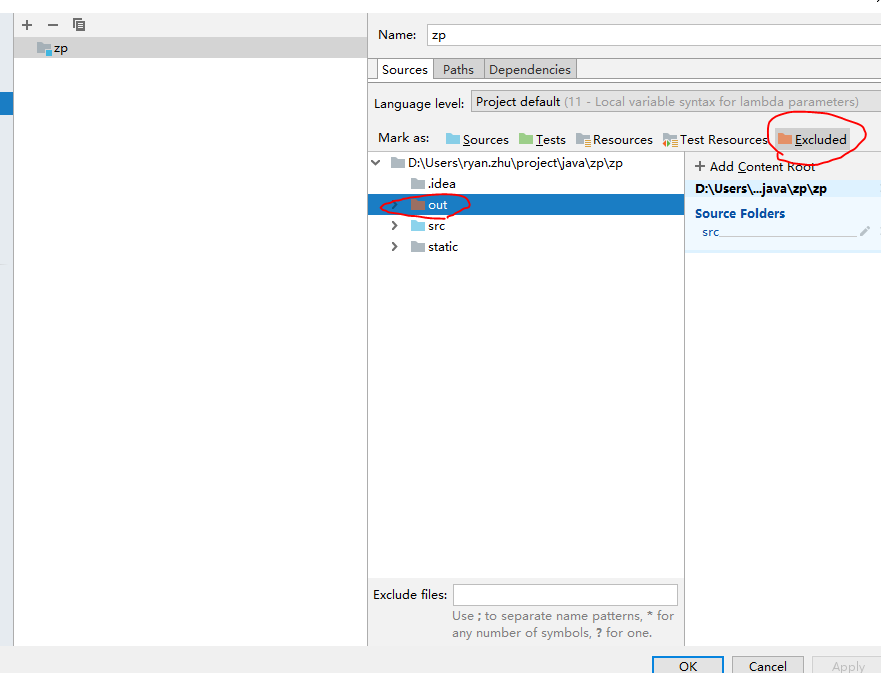

# 练习项目，每日学习记录以及代码规范

### I. idea 配置

> idea 是java 开发中常用的 IDE 开发工具。

- 据下图中的圈出部分，点击 file  -》 Project Structure 进入项目的配置界面

  

- 根据如下图，配置项目的SDK的项目配置，其中的 out 目录，根据自己的实际目录配置

  
  
- 根据如下两张图，分别配置项目的 source 目录，以及 out(target) 目录

  
  

### II. java 类编译运行基础过程

> 以下例子以 项目中的 ryan.example 为例

- 打开控制台(cmd, 或者 git bash) 进入项目中的 src(source 目录，所有的 java 代码都写在这里面) 目录

- 编写好 java 类之后，使用 javac 命令编译 .java 文件，如下

> javac ryan/example/App.java

- 编译通过之后，在 ryan/example 目录下将自动生成一个 java.class 文件，此时class 文件可以直接被 java 命令执行(但注意必须带上包名，如下将输出 Hello World!)

> java ryan.example.App

### III. 日常开发学习规范

- 所有的代码都在 src 目录中，额外分了两个包，ryan, zp 各自的代码写在各自的包下，每天的学习分别建立一个包，如第一个学习建立，zp.day1 的包，当天所有代码在 zp.day1 的包中，第二天则是 zp.day2。依次每天新建包练习，学习 java

- 代码中所有的运算符后面需要加上空格，比如+-x/ 前后都需要空格，例如
> 正确: 2 + 3
> 错误: 2+3

- 所有文件首字母大写，因为 java 中一般类名首字母大写，文件名与类名保持一致，如：
> 正确: App.java,    public class App{}
> 错误：app.java,    public class app{}

- 类的方法名应为驼峰式命名，首字母小写，后续单词首字母大写，如：

正确:
> public function main(){}

> public function getUser(){}

错误：
> public function Main(){}

> public function GetUser(){}

> public function _getUser(){}

> public function get_user(){}

- ~ 其它待补充...